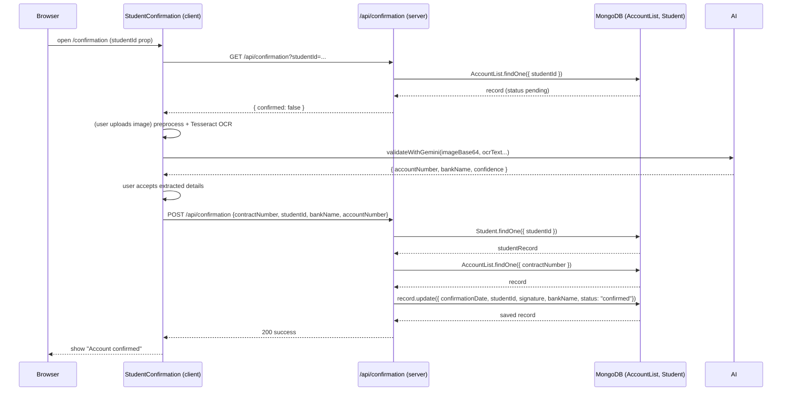
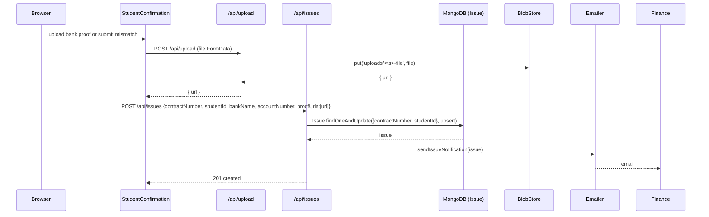
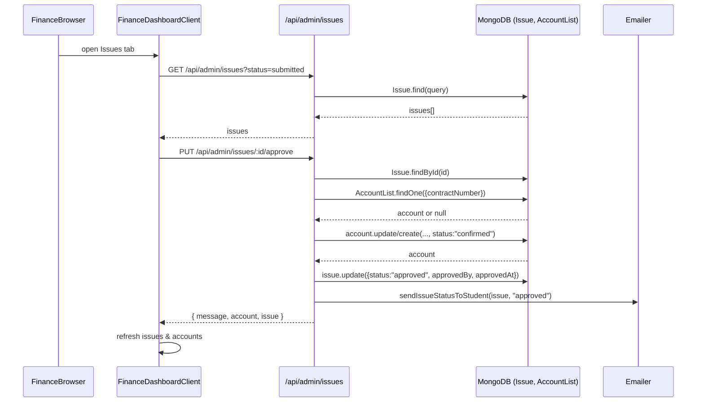

# Feature Context: Student Account Confirmation & Issue Resolution

Date: 2026-06-17

This document reverse-engineers the Student Account Confirmation and Issue Resolution workflows from the existing Next.js application and provides a complete technical migration guide for rebuilding the feature in a React + Express architecture.

It contains a full system overview, detailed happy-path and failure flows, frontend and backend architecture notes, database model documentation, migration guidance, and a step-by-step implementation checklist. The content mirrors the application's behavior and implementation as found in the repository.

---

## 1. System Overview

- **Purpose:** Student Account Confirmation — provide a self-service flow for students to confirm their bank account details (contract number + student ID + bank proof). If automated verification fails, provide an Issue Resolution workflow where students upload proof and finance staff review and either approve (update account records) or reject (request follow-up).
- **User roles involved:**
  - `student` — submit confirmation and issues (`ROLES.STUDENT`)
  - `finance` — review and resolve submitted issues (`ROLES.FINANCE`)
  - `admin` — higher privileges (not central to the flow but appears in UI)
- **End-to-end summary:** Student opens the confirmation page → client checks whether account already confirmed → student fills contract + student ID, uploads bank proof image → client runs OCR (Tesseract) + optional AI validation (`validateWithGemini`) → student confirms extracted bank/account or edits them → client POST to `/api/confirmation` → server verifies against stored `AccountList` → if match: set account `confirmed`; if mismatch: create/ upsert an `Issue` and notify finance → finance reads `/api/admin/issues` → finance `approve` or `reject` an `Issue` → approve updates/creates corresponding `AccountList` (marks `confirmed`) and emails student; reject marks `Issue` rejected and notifies student.
- **Frontend pages involved (source files):**
  - `app/(root)/confirmation/page.tsx` — server-side page that mounts the client component after authorization.
  - `components/StudentConfirmation.tsx` — client confirmation form, OCR + AI validation, submit logic.
  - `app/(root)/issues/page.tsx` — student issues page server wrapper.
  - `components/IssuesPageClient.tsx` — page layout for issues.
  - `components/StudentIssues.tsx` — student issue list + edit modal.
  - `app/(finance)/dashboard/page.tsx` — finance dashboard server wrapper.
  - `components/FinanceDashboardClient.tsx` — finance UI for reviewing issues and accounts.
  - `app/admin/issues/page.tsx` — admin app-issues page (separate AppIssue model).
- **Backend endpoints involved (source files):**
  - `GET /api/confirmation?studentId=...` — `app/api/confirmation/route.ts` (GET)
  - `POST /api/confirmation` — `app/api/confirmation/route.ts` (POST)
  - `POST /api/upload` — `app/api/upload/route.ts` (file upload to Vercel Blob)
  - `GET /api/issues?studentId=...` — `app/api/issues/route.ts` (GET)
  - `POST /api/issues` — `app/api/issues/route.ts` (create/upsert student issue)
  - `DELETE /api/issues?studentId=...` — `app/api/issues/route.ts` (delete many for student)
  - `GET /api/issues/:id` & `PUT /api/issues/:id` — `app/api/issues/[id]/route.ts`
  - `GET /api/accounts/students` — `app/api/accounts/students/route.ts` (returns accounts matching student’s issue contractNumbers)
  - Finance/admin routes:
    - `GET /api/admin/issues` — `app/api/admin/issues/route.ts`
    - `PUT /api/admin/issues/:id/approve` — `app/api/admin/issues/[id]/approve/route.ts`
    - `PUT /api/admin/issues/:id/reject` — `app/api/admin/issues/[id]/reject/route.ts`
- **Database collections / tables (Mongoose models):**
  - `AccountList` — `models/AccountList.ts` (primary canonical account records / import source)
  - `Issue` — `models/Issue.ts` (student-submitted verification issues)
  - `Student` — `models/Student.ts`
  - `User` — `models/User.ts`
  - `Role` — `models/Role.ts`
  - Support models: `AuditLog` (`models/AuditLog.ts`), `Confirmation` and others.

---

## 2. Student Account Confirmation Flow

This section traces the exact happy-path sequence from student opening the page to account successfully confirmed. Each step documents route/page, UI components, state variables, API calls (payloads/responses), validation rules, DB updates, and user-visible states.

High-level client flow (source): `components/StudentConfirmation.tsx`

### Step A — Page entry, authentication & student check
- **Route / page:** `app/(root)/confirmation/page.tsx` (Server Component)
- **Behavior:**
  - Calls `getCurrentUser()` (server helper in `utils/actions/auth.action.ts`) to verify token and get `user` (reads cookie token).
  - If not authenticated, redirect to `/sign-in`.
  - Connects to DB and loads `Student.findOne({ email: user.email })`. If not a student, returns `EmptyState`.
  - On success it renders the client component: `<StudentConfirmation studentId={student.studentId} />`
- **Key server-side helpers:** `connectDB()` (`utils/mongodb.ts`).

### Step B — Client mounts & initial confirmation check
- **Client component:** `components/StudentConfirmation.tsx`
- **UI components rendered initially:** form layout, `FormField` components for `contractNumber`, `studentId`, `bankProof` input, `graduating` checkbox, `Confirm Account` button.
- **Important state variables:**
  - `confirmed: boolean | null`
  - `loading: boolean`
  - `isExtracting`, `isValidatingWithAI`, `showReview`, `extractionConfirmed`
  - `extractedBankName`, `extractedAccountNumber`
  - `confirmedBankName`, `confirmedAccountNumber`
  - `previewUrl`, `ocrAttemptsRef`
- **API call(s):**
  - GET `/api/confirmation?studentId=${studentId}`
    - Response 200 success: `{ confirmed: true, message?: string, record?: AccountList }` or `{ confirmed: false, message?: string }`
    - 401 / 400 / 404 — handled and surfaced as toast errors.
- **UI transition:**
  - If `confirmed === true` → show an `EmptyState` view "Account Already Confirmed".
  - Otherwise show the confirmation form.

### Step C — Form validation rules (client)
- Implemented with Zod schema in `confirmationFormSchema()`:
  - `contractNumber`: must match `^\d{12}$` (exactly 12 digits)
  - `studentId`: must match `^\d{7}$` (exactly 7 digits)
  - `graduating`: `z.enum(["true","false"])`
  - `bankProof`: optional file
- Client uses `react-hook-form` + `zodResolver`.

### Step D — Optional Bank Proof upload, OCR + AI validation (client)
- **Trigger:** user selects a file in `bankProof` input.
- **Process overview:**
  - `preprocessImageForOcr(file)`: upscale, grayscale, threshold via canvas.
  - `Tesseract.recognize(processed, "eng", options)` for OCR.
  - `parseBankInfoFromText(text)` heuristics to find bank and account number.
  - `extractAccountCandidates(ocrText)` to create candidate account numbers.
  - `validateWithGemini(imageBase64, ocrText, candidates, normalizedBankName)` calls Google Gemini model (client currently calls it) and returns `GeminiExtractionResult`.
- **Client UI flows:**
  - `showReview` → review card with bank and account, confidence badge.
  - If user accepts: sets `confirmedBankName`, `confirmedAccountNumber`, `extractionConfirmed = true`.
  - If user edits: `isEditingReview` allows manual edit and save.
  - Retry or max OCR attempts triggers escalation to issues.

### Step E — Final Submit (client → server)
- **Precondition:** `extractionConfirmed === true` and confirmed fields present; Zod form valid.
- **Request:**
  - `POST /api/confirmation`
  - Body: `{ contractNumber, studentId, bankName: confirmedBankName, accountNumber: confirmedAccountNumber }`
- **Response handling:**
  - 200 OK `{ success: true, message, status: "correct" }` → client toasts success and sets `confirmed = true`.
  - 403 mismatch leads to toast error; server may have created an `Issue`.

### Step F — Server logic for `POST /api/confirmation` (server)
- **Authentication:** `getCurrentUser()` (cookie JWT) required.
- **Validation:** checks presence of `contractNumber`, `studentId`, `bankName`, `accountNumber`.
- **Student validation:** `Student.findOne({ studentId })` — 400 if missing.
- **Account lookup:** `AccountList.findOne({ contractNumber })` — 404 if not found.
- **Duplicate prevention:** `record.status === "confirmed"` → 409.
- **Matching logic:**
  - `smartProvidedBankName = extractBankNameSmart(bankName) || bankName`
  - `smartStoredBankName = extractBankNameSmart(record.bankName) || record.bankName`
  - `bankNameMatch = isBankNameMatch(smartStoredBankName, smartProvidedBankName)`
  - `accountNumberMatch = record.accountNumber === accountNumber.trim()`
  - If mismatch: upsert `Issue` and return 403.
  - If match: update `record` with `confirmationDate`, `studentId`, `signature = makeSignature(user.name)`, normalized `bankName`, `status = "confirmed"` and `save()`.

### Sequence diagram (happy path)

---

## 3. Failed Confirmation / Issue Creation Flow

This section describes the flow when a student cannot confirm directly (mismatch or OCR failure). It covers triggers, UI, forms, file uploads, image rules, state management, endpoints, DB writes, and notifications.

### Triggers for issue creation
- Backend mismatch during `POST /api/confirmation`: `bankNameMatch === false` OR `accountNumberMatch === false` → server upserts `Issue`.
- Client-side escalation: if OCR attempts exceed `MAX_OCR_ATTEMPTS = 2` or student chooses to escalate, client uploads images and POSTs to `/api/issues` via `escalateToIssues()`.

### UI shown to the student when not confirmed
- `StudentConfirmation` shows a toast error on mismatch and can guide the user to upload a clearer image or escalate.
- `StudentIssues` page (`components/StudentIssues.tsx`) shows a list of issues with card UI and an `Update Bank Details` modal.

### Forms (student issue create/update)
- **Create (student `POST /api/issues`)**
  - Body: `{ contractNumber, studentId, bankName, accountNumber, proofUrls?, notes? }`
  - Response 201: `{ message: "Issue recorded successfully.", issue }`
- **Update (`PUT /api/issues/:id`)**
  - Auth: `getCurrentUser()` must exist; allowed if `authUser.role === "finance"` OR `authUser.studentId === issue.studentId`.
  - Body: `{ bankName?, accountNumber?, notes?, proofUrls?: string[] }`
  - Response 200: `{ message: "Issue updated", issue }`

### File upload process and rules
- **Two-step process:**
  1. `POST /api/upload` with FormData `file`
     - Server uses `@vercel/blob.put('uploads/${Date.now()}-${file.name}', file, { access: 'public' })`
     - Response: `{ url: blob.url }`
  2. Client passes `proofUrls` array of returned URLs to `POST /api/issues` or `PUT /api/issues/:id`.
- **Image validation rules:** client `accept="image/*"`; server does not perform MIME/size validation in the current implementation.
- **Metadata stored:** only public URL strings in `Issue.proofUrls`.
- **Deletion:** no blob deletion endpoint implemented; removal is manual or requires extending the API.

### State management (client)
- StudentIssues maintains `issues`, `accounts`, `loading`, `error`, `showEditModal`, `editingIssue`, `editForm`, `editNotes`, `editProofFiles`. Uploads are done per-file and appended to `proofUrls`.

### Server DB writes on issue creation
- `POST /api/issues` upserts by `{ contractNumber, studentId }` and sets `status: "submitted"`, `proofUrls` as provided. Calls `sendIssueNotification(issue)`.
- `PUT /api/issues/:id` merges `proofUrls` and sets `status = "submitted"` and may call `sendIssueNotification`.

### Sequence diagram (failed confirmation -> issue created)

---

## 4. Uploaded Assets

- **Upload endpoint:** `app/api/upload/route.ts` — accepts multipart `file`, uses `@vercel/blob.put` and returns a public URL.
- **Storage provider:** Vercel Blob (via `@vercel/blob`). Replaceable with S3/Azure/GCP.
- **File naming strategy:** `uploads/${Date.now()}-${file.name}` (timestamp prefix + original filename).
- **Metadata stored:** only public URL strings in `Issue.proofUrls`.
- **Database references:** `Issue.proofUrls: string[]`.
- **Retrieval:** UI uses stored `proofUrls` as `src` for thumbnails/anchors.
- **Deletion:** not implemented; add a dedicated endpoint and storage delete operation for cleanup.

---

## 5. Frontend Architecture

This section enumerates pages and components with file locations and detailed UI / state usage.

A. **`Student Confirmation` page**
- File: `app/(root)/confirmation/page.tsx` (Server Component) — verifies `getCurrentUser()` and loads `Student` then renders the client.
- Client: `components/StudentConfirmation.tsx`
  - Components: `FormField`, `Button`, `Form`, `EmptyState`, `Image`, `Earth`.
  - Hooks: `useState`, `useRef`, `useEffect`, `useInView`, `useForm`, `useRouter`.
  - Loading states: `loading`, `isExtracting`, `isValidatingWithAI`.
  - Error states: toasts for OCR and API failures.
  - Conditional rendering: `showReview`, `extractionConfidence` control candidate selection and review flows.
  - Business rules: submission only allowed when extraction is confirmed; max OCR attempts 2 triggers escalation.

B. **`Student Issues` page**
- Files: `app/(root)/issues/page.tsx`, `components/IssuesPageClient.tsx`, `components/StudentIssues.tsx`.
  - `StudentIssues.tsx` hooks: `useState` for `issues`, `accounts`, modals and edit form state.
  - API calls: `GET /api/issues?studentId=...`, `GET /api/accounts/students`, `PUT /api/issues/:id`.
  - UI: issue cards, `Update Bank Details` modal (bankName, accountNumber, notes, file upload).
  - Business rules: students update `Issue` document rather than `AccountList` directly.

C. **Finance Dashboard**
- Server wrapper: `app/(finance)/dashboard/page.tsx`.
- Client: `components/FinanceDashboardClient.tsx`.
  - Hooks: `useState` for `activeTab`, `issues`, `accounts`, `filters`, etc.
  - API interactions: `GET /api/admin/issues`, `PUT /api/admin/issues/:id/approve`, `PUT /api/admin/issues/:id/reject`.
  - UI: Issues tab shows proofs and `Approve` / `Reject` actions.
  - Business rules: Approve updates/creates `AccountList` and sets `Issue.status = "approved"`; Reject appends reason and sets `status = "rejected"`.

---

## 6. Backend Architecture (endpoints)

Detailed per-endpoint documentation with request/response schemas, auth/authorization, validation, database operations and error handling.

1) `GET /api/confirmation?studentId=...` — `app/api/confirmation/route.ts` (GET)
- Auth: `getCurrentUser()` required.
- Query: `studentId` required.
- Behavior: return `{ confirmed: true|false, record? }` or 404 / 401.

2) `POST /api/confirmation` — `app/api/confirmation/route.ts` (POST)
- Auth: `getCurrentUser()` required.
- Body schema: `{ contractNumber: string, studentId: string, bankName: string, accountNumber: string }`.
- Behavior: validate `Student`, find `AccountList` by contractNumber, if match update record and mark `confirmed`; if mismatch upsert `Issue` and return 403.

3) `POST /api/upload` — `app/api/upload/route.ts`
- Accepts multipart `file`, uses `@vercel/blob.put` and returns `{ url }`.

4) `GET /api/issues?studentId=...` — `app/api/issues/route.ts`
- Public (requires `studentId` param), returns issues for student excluding approved.

5) `POST /api/issues` — `app/api/issues/route.ts`
- Body: required `{ contractNumber, studentId, bankName, accountNumber }`.
- Behavior: upsert `Issue` keyed by `{ contractNumber, studentId }` and call `sendIssueNotification`.

6) `DELETE /api/issues?studentId=...` — deletes issues for a student (auth required).

7) `GET /api/issues/:id` and `PUT /api/issues/:id` — `app/api/issues/[id]/route.ts`
- `GET`: return issue by id.
- `PUT`: authorized if `authUser.role === "finance"` or `authUser.studentId === issue.studentId`; update fields and, if changed, set `status = "submitted"` and `sendIssueNotification`.

8) `GET /api/accounts/students` — `app/api/accounts/students/route.ts`
- Auth required; reads `Issue` for `user.studentId`, returns `AccountList.find({ contractNumber: { $in: contractNumbers } })`.

9) Admin finance endpoints: `app/api/admin/**` as listed earlier; key ones are listing issues and approve/reject endpoints that update `Issue` and `AccountList` accordingly.

Common service functions called:
- `getCurrentUser()` — `utils/actions/auth.action.ts` — reads cookie token and returns user snapshot.
- `extractBankNameSmart`, `isBankNameMatch`, `normalizeBankName` — `utils/bankMapping.ts` used for normalization and comparison.
- `sendIssueNotification`, `sendIssueStatusToStudent` — `utils/emailer.tsx` uses `nodemailer` to email finance and students.
- `makeSignature` — `lib/utils.ts` used to generate a signature string stored on `AccountList`.

Error handling: routes log errors and return JSON `{ error: "..." }` with appropriate HTTP statuses.

---

## 7. Issue Resolution Flow (Finance Role)

This section documents the admin/finance flow from issue submission to resolution with UI and DB changes.

### Flow steps (source UI): `components/FinanceDashboardClient.tsx`
1. Notification & discovery
  - `sendIssueNotification(issue)` emails finance recipients (or logs to console if SMTP not configured).
  - Finance sees issues by `GET /api/admin/issues?status=submitted`.

2. Review UI
  - Issue card shows contract, student id, bank, account, status, notes, proof thumbnails.
  - Finance can `Approve` or `Reject`.

3. Approve action (server)
  - Auth: `requireFinance()`.
  - Normalize bank name.
  - Find or create `AccountList` by `contractNumber` and set `bankName`, `accountNumber`, `studentId`, `confirmationDate`, `signature`, `status = "confirmed"`.
  - Set `issue.status = "approved"`, `approvedBy`, `approvedAt` and call `sendIssueStatusToStudent(issue, "approved")`.

4. Reject action (server)
  - Set `issue.status = "rejected"`, `rejectedBy`, `rejectedAt`, append reason to `notes` and call `sendIssueStatusToStudent(issue, "rejected", reason)`.

### Audit info stored
- `Issue`: `approvedBy`, `approvedAt`, `rejectedBy`, `rejectedAt`, `notes` containing finance reason.
- `AccountList`: `confirmationDate`, `signature`, `studentId`, `status`.
- Note: explicit `AuditLog` entries are not created by the approve/reject endpoints in current implementation; add them if required.

### Sequence diagram (finance resolution)

---

## 8. Database Model Documentation

For each model include fields, types, required fields, relationships, indexes, defaults.

A. `AccountList` (`models/AccountList.ts`)
- Fields:
  - `fullnames: string` (optional)
  - `firstName: string` (optional)
  - `surname: string` (optional, indexed)
  - `contractNumber: string` (unique)
  - `courseOfStudy: string` (optional)
  - `bankName: string` (optional)
  - `accountNumber: string` (optional)
  - `confirmationDate: string` (set on confirmation)
  - `studentId: string` (set on confirmation)
  - `signature: string` (digital signature)
  - `status: enum("pending","confirmed","erroneous","paid")` default: `"pending"`
  - `graduating: "false" | "true"` default: `"false"`
  - `batchNumber: number` (set during import)
  - `paidDate: string`
  - `importedAt: Date`, `importedBy: ObjectId -> User`, `importActivityId: ObjectId -> ImportExportActivity`.
- Indexes: `surname`, unique `contractNumber`.

B. `Issue` (`models/Issue.ts`)
- Fields:
  - `contractNumber: string` (required)
  - `studentId: string` (required, indexed)
  - `bankName: string` (required)
  - `accountNumber: string` (required)
  - `proofUrls: string[]` (default `[]`)
  - `notes: string` (optional)
  - `status: enum("submitted","approved","rejected","updated")` default `"submitted"`
  - `approvedBy`, `approvedAt`, `rejectedBy`, `rejectedAt`
  - timestamps `createdAt`, `updatedAt`

C. `Student` (`models/Student.ts`)
- Fields:
  - `name`, `surname`, `email` (required), `studentId` (required, unique), `studentStatus: boolean`.

D. `User` (`models/User.ts`)
- Fields:
  - `name`, `email`, `studentId`, `password`, `studentCardUrl`, `role: ObjectId -> Role` plus optional face descriptor fields.

E. `Role` (`models/Role.ts`)
- Fields: `name` (required, unique), `permissions: string[]`.

F. `AuditLog` (`models/AuditLog.ts`)
- Fields: `entityType`, `entityId`, `action`, `performedBy`, `performedBySnapshot`, `changes`, `meta`.

ERD-style relationships (textual):
- `User` (1) — (many) `AccountList` via `importedBy`.
- `Issue` linked to `AccountList` via `contractNumber` (string key, not formal ref).
- `Student` ↔ `User` link via `studentId` string.

---

## 9. Migration Notes (Next.js -> React + Express)

This section lists what can be reused, Next.js-specific code to reimplement, hidden dependencies, and migration risks.

A. What can be reused (with minimal changes)
- Mongoose model definitions: `models/*.ts`.
- Utilities: `utils/bankMapping.ts`, `lib/utils.ts`, `utils/jwt.ts`, `utils/emailer.tsx` (nodemailer) — with path updates.
- Business logic in server endpoints (confirmation matching, issue upsert, approve/reject logic).

B. Next.js-specific parts to reimplement
- Server components & `cookies()` usage: replace with Express middleware (`cookie-parser`) and `verifyToken()`.
- `NextResponse` and `next/navigation` usages: replace with Express handlers and client-side routing (`react-router`).
- `next/image` usage: replace with `` or an image optimization library for React.

C. Server reimplementation in Express
- Recreate each `app/api/*` route as Express route handlers.
- Implement authentication middleware to set `req.user`.

D. Client reimplementation in React
- Replace server components with client routes. Use `GET /api/auth/me` or `GET /api/confirmation` to fetch initial data.

E. Hidden dependencies & security notes
- `validateWithGemini` uses `GoogleGenerativeAI` with env key exposed via `NEXT_PUBLIC_*` — security risk. Move AI calls server-side.
- `@vercel/blob` ties uploads to Vercel; choose S3 or equivalent for Express deployments.

F. Potential migration risks
- Exposed AI keys; OCR heavy computation in browser; missing upload validation; race conditions on `AccountList.create`.

---

## 10. Implementation Checklist

Follow this step-by-step checklist to rebuild the feature in React + Express.

1. Project skeleton
   - Create Express server and React client; add Mongoose and DB connection.
   - Add `cookie-parser`, `multer`, `express.json()`.
   - Copy Mongoose models.
2. Auth middleware
   - Implement `authenticate` middleware using `verifyToken()`.
   - Implement `requireRoles()` middleware.
   - Create `GET /api/auth/me` endpoint.
3. API endpoints (server)
   - Implement `GET /api/confirmation`, `POST /api/confirmation`.
   - Implement `POST /api/issues`, `GET /api/issues?studentId`, `PUT /api/issues/:id`.
   - Implement file upload endpoint `POST /api/upload` using chosen storage provider.
4. File upload & storage
   - Implement S3 or `@vercel/blob` logic; ensure public URL returns.
   - Add server-side validation (mime, size).
5. Admin/Finance routes
   - Implement `GET /api/admin/issues`, `PUT /api/admin/issues/:id/approve`, `PUT /api/admin/issues/:id/reject`.
6. Emailer
   - Copy `utils/emailer.tsx` nodemailer integration and templates; verify SMTP env vars.
7. AI validation migration (security)
   - Move `validateWithGemini` to a server endpoint `POST /api/ai/validate`.
8. Client pages
   - Port `StudentConfirmation` and `StudentIssues` components to React and wire to Express endpoints.
9. Testing & security
   - Add unit and integration tests for `POST /api/confirmation` and admin approve/reject flows.
10. Deployment & config
   - Configure storage, SMTP, JWT secret, and seed `Role` entries.

### Optional improvements
- Add `AuditLog` writes on admin actions.
- Consider server-side OCR to reduce client CPU usage.

---

## References (key source files)
- Frontend: `components/StudentConfirmation.tsx`, `components/StudentIssues.tsx`, `components/FinanceDashboardClient.tsx`, `components/IssuesPageClient.tsx`
- Server: `app/api/confirmation/route.ts`, `app/api/issues/route.ts`, `app/api/issues/[id]/route.ts`, `app/api/upload/route.ts`, `app/api/accounts/students/route.ts`, admin routes under `app/api/admin/**`
- Models: `models/AccountList.ts`, `models/Issue.ts`, `models/Student.ts`, `models/User.ts`, `models/Role.ts`, `models/AuditLog.ts`
- Utilities: `utils/bankMapping.ts`, `utils/geminiExtraction.ts`, `utils/emailer.tsx`, `utils/actions/auth.action.ts`, `utils/mongodb.ts`, `lib/utils.ts`, `utils/jwt.ts`

---

If you want I can:
- Generate a ready-to-run Express route file set that mirrors the Next.js logic (one-to-one), or
- Generate React page components (client) that match the current UI behavior, or
- Produce a migration PR skeleton with server routes, middleware, and a small test suite.

Which next step would you like me to implement first?
